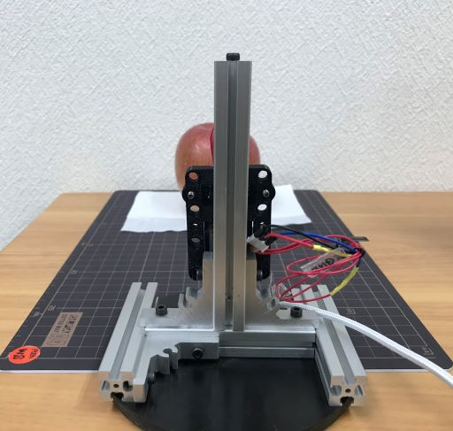

# M5Camera-CVA-App

### contents
- Description of the Files
- How to Use
- 注意
- About Google Cloud Vison API
- 認識マニュアル

## Description of the Files

- `/M5Camera-CVA-App`: Python src
    - `/photo`: 検知画像保存ファイル
    - `/temp`: 一時ファイル
        - `request.json`: 一時ファイル
        - `image_out.base64`: 一時ファイル
    - `m5camera-cva-app.exe`: 実行ファイル
    - `m5camera-cva-app_0.4.py`: main script file
    - `response.json`: 検知結果
    - `cva.sh`: script file
    - `config.json`: 設定ファイル
- `/m5camera-detect`: Arduino src
    - `m5camera-detect.ino`
    - `app_httpd.cpp`
    - `camera_index.h`
    - `jpeg_http_capture.h`
    - `camera_pins.h`
- `README.md`
- `installation-Arduino.md`
- `installation-Python.md`

<div style="page-break-before:always"></div>

## How to Use

1. カメラ電源ON（USBケーブルでPCに接続）

2. アプリを起動
    "m5camera-cva-app.exe"を起動  
    または  
    コマンドプロンプト、"Git for Windows"等から  
    "m5camera-cva-app_0.4.py"を起動
    ```
    python -u m5camera-cva-app_0.4.py
    ```

3. 初期設定
    アプリの使用にはいくつかの値の変更が必要です。  
    - M5CameraをWifiルーターに接続するために、SSIDとPasswordの変更
    - M5Cameraと通信するためのIPアドレスの変更
    - Google Cloud Vision APIの仕様のためAPIキーの変更  
    ※APIキーについては後述の"About Google Cloud Vison API"をご覧ください  
    変更には複数の方法があります。
    1. [方法1] M5Cameraのソースコードを修正し、プログラムを書き込む (推奨)  
        - "installation-Arduino.md"をご参照ください。

    1. [方法2] config.jsonをテキストエディタから変更する。  
        - お使いのルーターのSSIDとPasswordに変更してください。
        - お使いのアカウントのapi-keyに変更してください。
        - お使いのM5CameraのIPアドレスに変更してください。
        ```
        "ip-addres": "192.168.2.117",
        "port": 50104,
        "photo-name": "photo_",
        "ssid": "SSID",
        "password": "PASSWORD",
        "api-key": "AaAaAaAaAaAaAaAaAaAa-AaAaAaAaAaAaAaAaAa"
        ```

    1. [方法3] Python アプリ上から変更  
        "ssid"と入力すると"Input SSID"と表示されますので、  
        お使いのルーターのSSIDを入力してください。
        ```
        >> ssid
        Input SSID
        >> Your router SSID
        ```
        "pass"と入力すると"Input Password"と表示されますので、  
        お使いのルーターのPasswordを入力してください。
        ```
        >> pass
        Input Password
        >> Your router Password
        ```
        設定したSSID等をM5Cameraに送信します。  
        "cnw"と入力してください
        ```
        >> cnw
        b"..Camera Ready! Use 'http://192.168.2.117' to connect\r\n"
        Auto connection
        serialClose
        >>
        CONNECT
        ```
        "not connect"と表示された場合は、"serial"と入力してから再度"cnw"と入力してください。
        ```
        >> cnw
        not connect
        >> serial
        m5camera serial connect
        >> .................cnw
        >> ...............
        b"..Camera Ready! Use 'http://192.168.2.117' to connect\r\n"
        Auto connection
        serialClose
        >>
        CONNECT
        >>
        ```
        この際表示される"192.168.2.117"等の数字が、M5Cameraとの通信に必要なIPアドレスとなります。
        "m5ip"と入力した後にIPアドレスを入力して下さい
        ```
        >> m5ip
        Input m5ip. Example: 192.168.1.255
        >> 192.168.2.117
        Change ip
        save param
        ```
        IPアドレスを変更した場合は再起動が必要なため自動でアプリが終了します。

<div style="page-break-before:always"></div>

4. ネットワークコネクション  
    "con"と入力してください
    ```
    >> con
    ```
    初期設定にてM5Cameraのソースコードを修正していない場合は
    "cnw"と入力してください
    ```
    >> cnw
    ```

5. キー入力によりブラウザにカメラ映像表示  
    "str"と入力してください
    ```
    >> str
    ```
6. カメラと物体の位置を定める。
7. 測距センサによる認識(認識中はM5Cameraの赤LEDが点灯します。  
    その状態で5秒間保持させてください。)、
    またはキー入力によりシャッターを切る事で、PCで見えていた画面が静止画として保存される。  
    キー入力の場合は  
    "det"と入力してください
    ```
    >> det
    ```
    画像は/photoフォルダに保存されます。
8. 画像をGoogleCloudに送る、処理した結果を受け取る。(json)
9. 処理した結果をコマンドライン上に表示

## 注意

- 認識に使われる測距センサの反応距離が80㎝程度あるため、連続して検知する可能性がある。
- 対策としてソフトウェア上では検知してから10秒の不検知時間を設けている。
- アプリからシャッターを切る操作が可能なため、自動検知が不要な場合はセンサのケーブルを外すことでこれを無効化できる。

<div style="page-break-before:always"></div>

## About Google Cloud Vison API

[Google Cloud](https://cloud.google.com/)  
[GCV demo](https://cloud.google.com/vision/?hl=ja)

- 1000/月まで無料
- カウントが認識したい項目ごとであり、下記の2つを使用しているため、500/月まで無料となる。
    1. 物体認識
    1. テキスト認識

1. アカウントの作成方法

    1. Googleアカウントをお持ちでない場合は作成してください。
    2. [Google Cloud](https://cloud.google.com/)にアクセス
    3. 無料で始めるをクリック
    4. Googleアカウントでログイン
    5. 登録がはじまるので指示に従ってください。
    6. 無料トライアルを開始
2. APIキーの作成

    1. [Google Cloud](https://cloud.google.com/)から"コンソールへ移動"をクリック
    2. 画面左上の"Google Cloud Platform"の横にあるボタンをクリック
    3. 新しいプロジェクトを作成をクリック
    4. 任意のプロジェクト名を入力し、"作成"をクリック
    5. 画面上部の検索フォームに"vision api"と入力すると「Cloud Vision API」が表示されるのでクリック
    6. "有効にする"をクリック
    7. [APIとサービス.認証情報](https://console.cloud.google.com/apis/credentials?folder=&hl=ja)に移動
    8. 画面上部の"+認証情報を作成"をクリック
    9. "APIキー"をクリックすると作成されます。
    10. APIキーをコピーしてください。

3. APIキーの変更

    1. config.jsonをテキストエディタで編集  
        - api-keyの値を作成したAPIキーに変更してください。

        ```
        "ip-addres": "192.168.2.117",
        "port": 50104,
        "photo-name": "photo_",
        "ssid": "SSID",
        "password": "PASSWORD",
        "api-key": "AaAaAaAaAaAaAaAaAaAa-AaAaAaAaAaAaAaAaAa"
        ```

<div style="page-break-before:always"></div>

## 認識マニュアル

- 背景は白色の紙や壁を推奨  
  牛乳パックやワインなどの文字の認識が必要な場合は、  
  文字がなるべく大きいものを推奨

- 標準推奨距離：25cm

- カメラ解像度はXGA（1024x768）以上を推奨（初期値）  
  解像度を上げる、もしくは距離を15㎝に近づけることで、  
  賞味期限の認識結果がよくなる。
  キー入力"config"により、ウェブブラウザにM5Cameraの
  設定画面が表示されます。
  そこで解像度の変更をすることが可能です。

- 台座は高さ調整が可能ですが、ドライバが必要です。  
  ねじが2か所あり、測距センサとM5Cameraの間に１つ、  
  M5Cameraの後ろに１つあります。

1. りんご  
    - 直径8㎝程度のもの
    - 推奨距離：20㎝  
    - レンズ高さ6㎝  

2. ばなな  
    - 長さ15～20㎝  
    - 横向き  
    - 推奨距離：25㎝  
    - レンズ高さ6㎝  

3. みかん  
    - 直径8㎝程度のもの  
    - 推奨距離：20㎝  
    - レンズ高さ6㎝  

4. 牛乳パック  
    - 検証に使用した銘柄
    1. 雪印コーヒー 1000ml
    - 全体をカメラ内に収める場合は35cm～40cm離す
    - レンズ高さ12.5㎝  
    - 解像度はUXGA(1600x1200)推奨

5. ミニ牛乳パック
    - 検証に使用した銘柄
    1. 明治おいしい牛乳　500ml
    2. 北海道3.8牛乳 500ml
    - 推奨距離：25cm
    - レンズ高さ7.5㎝

6. ワイン
    - 検証に使用した銘柄
    1. JEAN BOUCHARD BOURGOGNE CHARDONNAY
    - 全体をカメラ内に収める場合は35cm～50cm離す
    - レンズ高さ12.5㎝
    - 解像度はUXGA(1600x1200)推奨

- 参考画像




### Programming Tools
- Arduino 1.8.9
- Python 3.7.4